# Premiere Pro Theme

A [Windhawk](https://windhawk.net/) mod that recolors the whole Adobe Premiere
Pro interface — panels, timeline, monitors, window frame and menu bar — far
past what the Appearance brightness slider reaches.

Fifteen palettes — four near-black, four tinted, five vivid and two that hold a
strong accent over near-black panels — plus a custom theme, one labelled field
per color in the settings, down to the band behind the video. A theme is a
block of YAML in the settings' own text mode, so it can be pasted straight in.
Eight of the palettes also give Premiere's blue a hue of their own.

## Screenshots

The same project, palette by palette. First, Premiere without the mod:

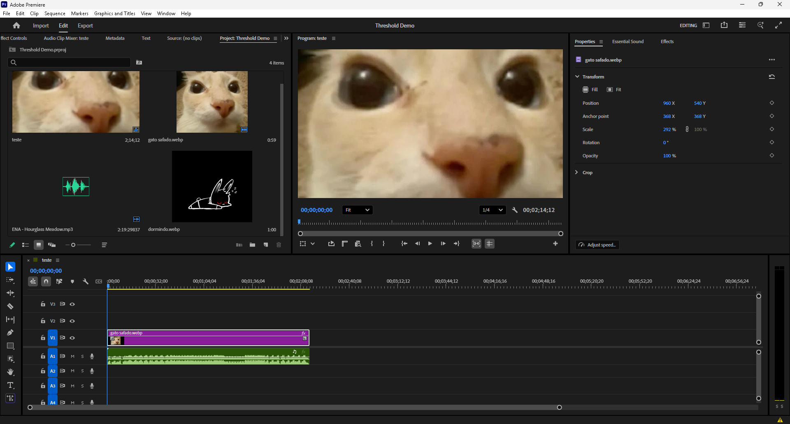

**Onyx** — the default: near black, and neutral:

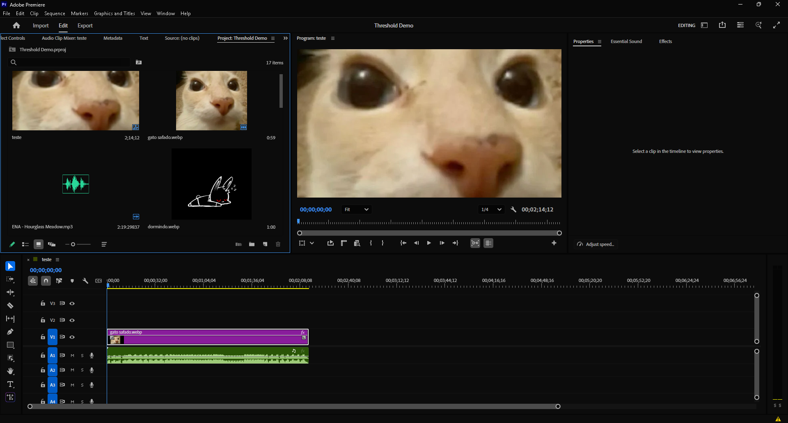

**Abyss** — absolute black, for an OLED panel:

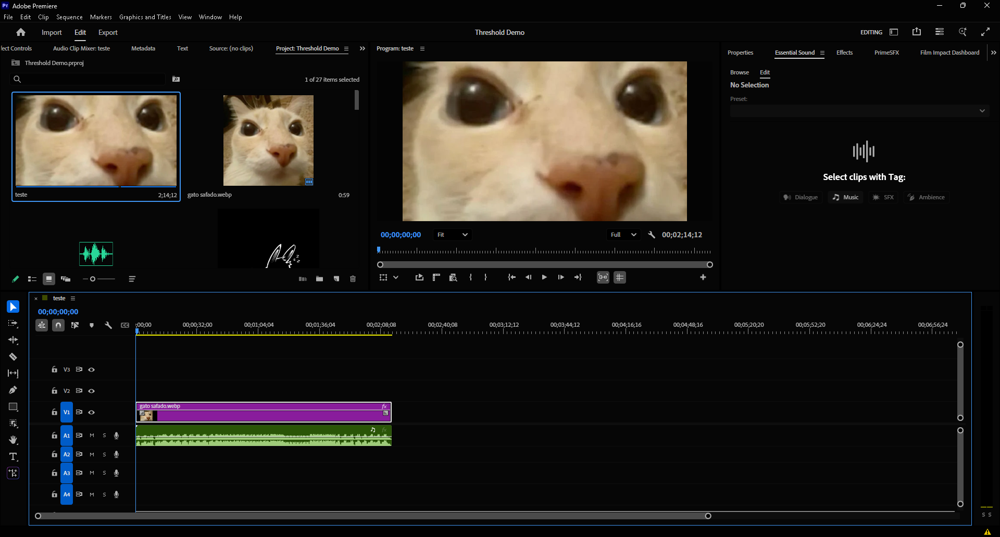

**Contrast** — black panels with light dividers and pure white text:

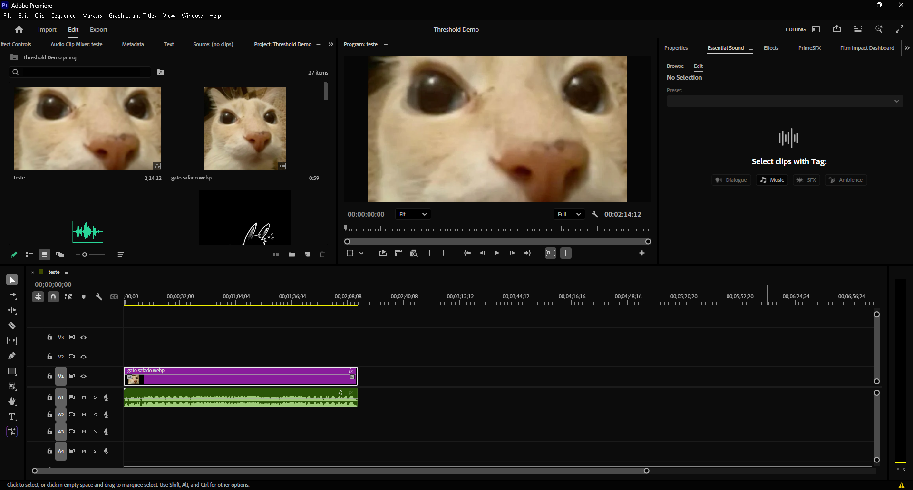

**Premiere** — the violet sampled from the app icon:

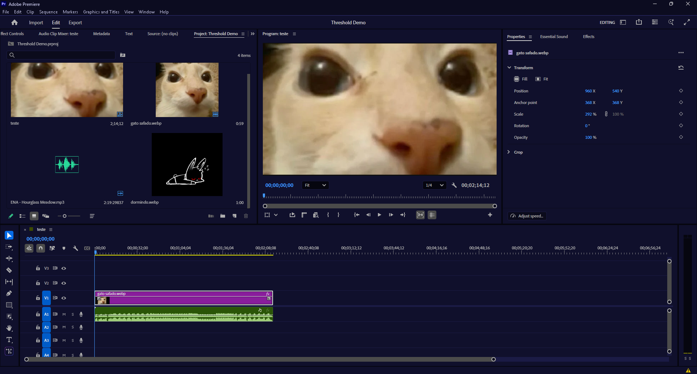

**Comfy** — warm brown, low contrast for long sessions:

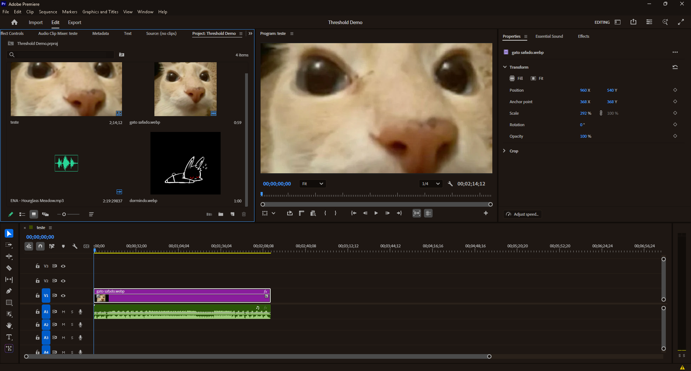

**Glitch** — acid green with a magenta accent:

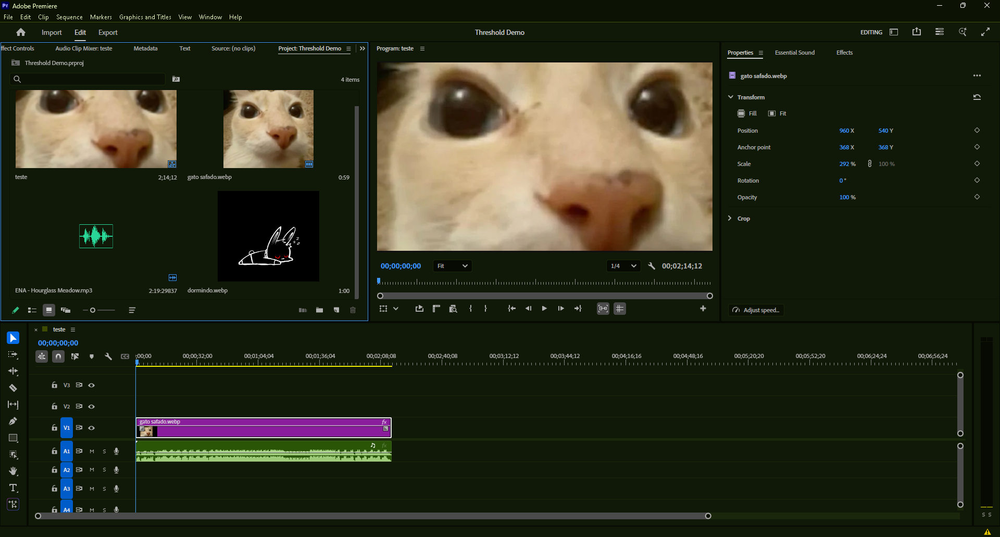

**Violet** — a purple interface, not just a purple accent:

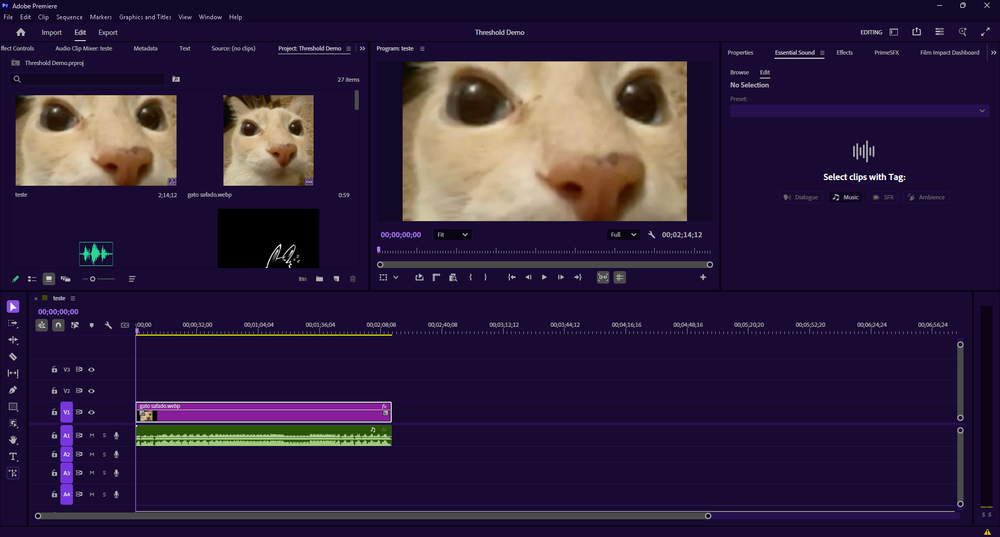

**Blossom** — dark rose, pastel in its text and border:

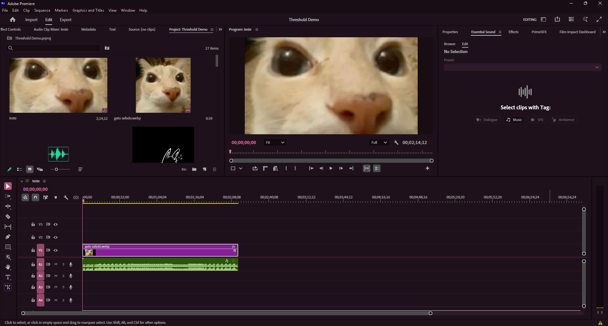

**Ember** — near black under a strong orange:

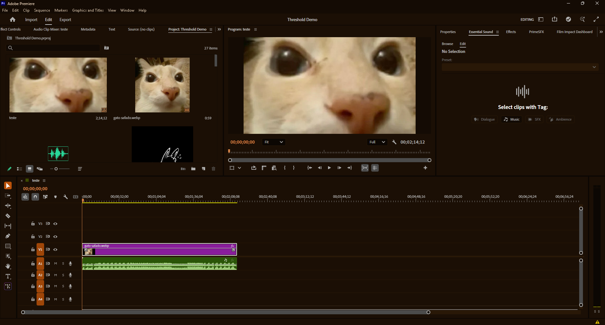

**Crimson** — near black under a strong red:

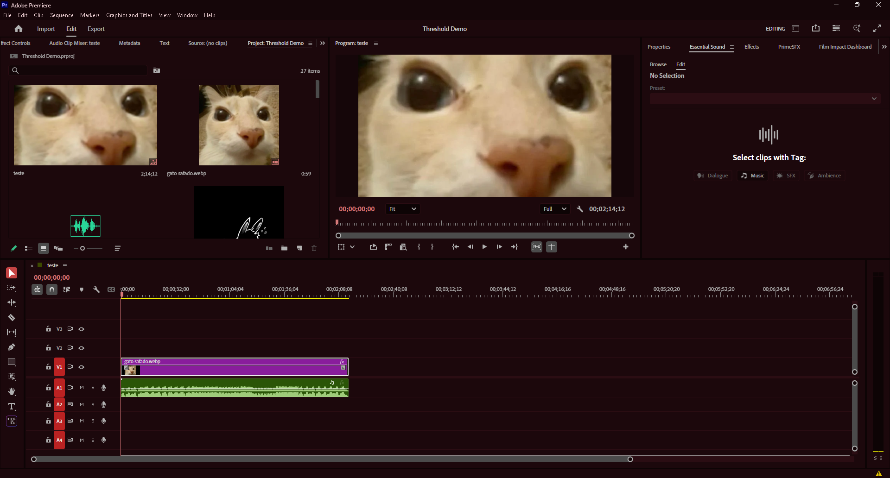

**Amethyst** — neutral panels, the purple only on the edges:

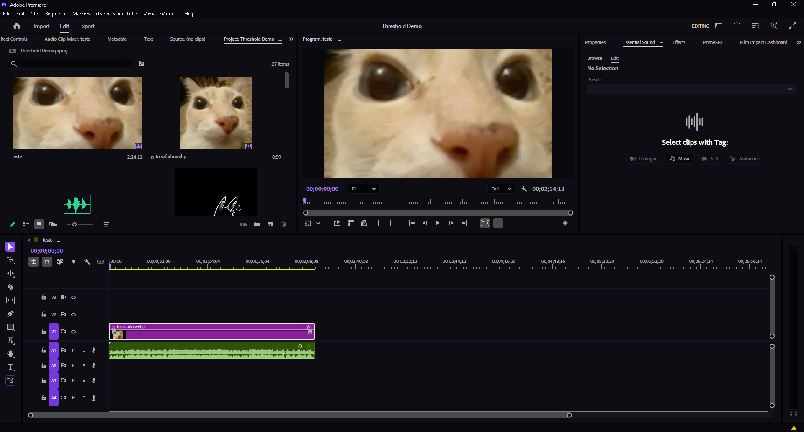

**Threshold** — `#050505`, `#FFFFFF` and `#DC2626`:

## Install

1. Install [Windhawk](https://windhawk.net/).
2. Find **Premiere Pro Theme** in the mod browser and install it.
3. Restart Premiere. Premiere only repaints everything on startup.

To build it yourself instead: create a new mod in Windhawk, paste
[`premiere-pro-theme.wh.cpp`](premiere-pro-theme.wh.cpp) over the template, and
compile.

## What it does

Premiere paints its interface through six different mechanisms, and the mod
covers all six:

- **`dvaui.dll`** — Adobe's UI toolkit, which hands out the Spectrum gray ramp
  (`#1D1D1D`, `#262626`, `#303030`, `#4B4B4B`). Thirty-one color functions are
  intercepted here: the classic theme, the Spectrum ramp, and the DNA/skins
  families.
- **`UIFramework.dll`** — Premiere's own drawing layer, for surfaces that fill a
  rectangle without ever consulting the theme.
- **The Direct2D brush factory** — where most solid fills pass through,
  whoever picked the color.
- **Win32** — the title bar, the `File / Edit / Clip` menu bar and the dropdown
  menus, none of which any theme reaches.
- **UXP** — the Text panel, Import, Export and the Home screen, drawn from
  stylesheets and design tokens of their own; the mod recolors both as
  Premiere reads them.
  Off by default: a panel reads its stylesheet once, so that layer only
  follows a change across a restart.
- **D3D12** — the band around the picture in the Source and Program monitors,
  which `DisplaySurface.dll` draws on the GPU, outside every layer above. A
  custom theme can give that band a tone of its own.

The full explanation of how each is found, what is deliberately left untouched,
and why the palettes are the colors they are, is in the mod's own readme at the
top of [`premiere-pro-theme.wh.cpp`](premiere-pro-theme.wh.cpp) — which is also
what Windhawk shows on the mod's page. It is kept there rather than duplicated
here, so there is only one copy to keep true.

## Compatibility

Every color function is looked up by name at startup; the ones the running build
exports get hooked and the rest are logged and skipped. A Premiere version that
moved or dropped a function loses that surface, not the mod.

| Premiere | Color functions found | Drawing primitives |
|----------|-----------------------|--------------------|
| 2026     | 31 of 31              | 4 of 4             |
| 2023     | 27 of 31              | 4 of 4             |

The window frame, menu bar and native dialogs are Windows, not Premiere, and
work on any version. Native dark mode needs Windows 10 build 17763 or newer.

## Known limitations

Two surfaces need a word of their own, and the mod says so in its log rather
than leaving you to guess:

- **UXP panels follow a change after a restart**, which is why that layer ships
  off. The Text panel, Import, Export and the Home screen read their
  stylesheets once, when they load, so turning it on, a palette switch, or
  disabling the mod, shows there after Premiere restarts.
- **The band around the video in the monitors** is drawn on the GPU, by
  `DisplaySurface.dll`. The mod recognizes those draws by the module they come
  from and by the color they carry, and changes that color — never the black
  behind the picture, which is what a clip with an alpha channel is composited
  onto. It has its own switch, **Monitor band**, and ships off: it is the only
  layer that hooks Direct3D, and the only one that writes into a command list
  it does not own. Turned on, it goes in either from the device Premiere
  creates or, when the switch is flipped later, from one of the mod's own —
  no restart in either direction.

## How those two work

The mod's own readme says what they do; this is how.

### A UXP panel keeps its colors twice

The stylesheet is one. The other is a table of design tokens in the panel's
own script, which its components read and set as inline styles — and an inline
style beats every rule a stylesheet can state. The search field in the Text
panel is one of those: its fill comes from
`"background-color":"rgb(37, 37, 37)"` in `main.js`, and no amount of
recoloring `main.css` reaches it.

So the mod recolors that shape too, and only that shape: a `<name>-color` key
whose value is an `rgb()` string. It does not go looking for hex colors in a
script the way it does in a stylesheet — the icons in the same file are hex,
and an icon has to stay an icon — and it rewrites the digits inside the quotes
at their own length, so the script parses exactly as it did.

This costs a panel one extra read of its own script when it loads, because a
file has to be read to know whether it holds any tokens at all. Measured on
Premiere 2026: 118 files and 38.4 MB under `UXP\plugins`, of which 9 files and
14.9 MB carry tokens — the other 109 are read and discarded. Size is no
filter, since the largest one carrying tokens is 7.5 MB. That is why it rides
on the same switch as the stylesheets rather than getting one of its own.

### The band is a quad per side of the picture

Zoomed out, the monitors paint the area around the picture outside every layer
above: Premiere lays its panel gray over that area as a quad per side, through
`DisplaySurface.dll`. The mod recognizes those calls by the module they come
from and by the color they carry, and replaces the color those quads paint
with on its way to the shader.

Only those quads change. What shows between them — behind the picture — is the
clear, which is black, and is also the backing the picture is composited onto.
Coloring it would come through anything the picture does not cover, whether
that is a gap in the timeline or the transparent part of a clip with an alpha
channel. So it is left exactly as Premiere draws it, which is why a
transparent PNG still sits on black.

## Questions, bugs and palettes

Bug reports and palette suggestions are welcome on
[Discord](https://discord.gg/m5kVMR8Vuu), where a Premiere build and a
screenshot are usually all it takes to work one out.

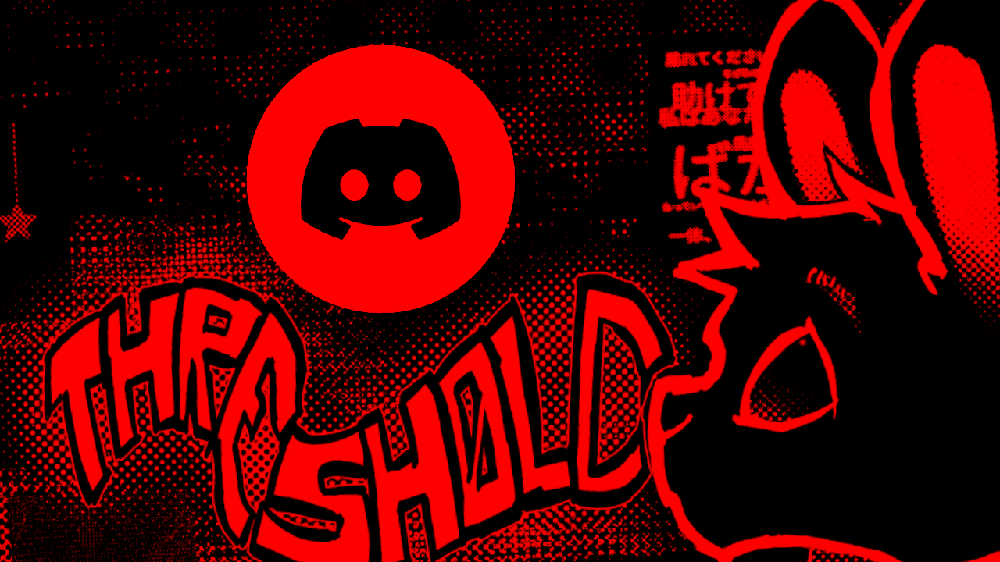

## Credits

The menu bar technique — the undocumented `WM_UAHDRAWMENU` messages and the
`DarkMode::Menu` theme class — comes from
[win32-darkmode](https://github.com/adzm/win32-darkmode) by adzm, MIT licensed.

## License

MIT. See [LICENSE](LICENSE).

Not affiliated with or endorsed by Adobe. Adobe and Premiere Pro are trademarks
of Adobe Inc.
